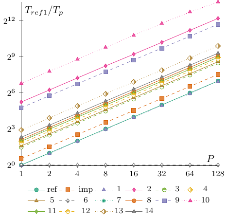

# Optional Homework 1.5 Results

Here are the results for round one of the DPA Cup. As promised, the results have been anonymized. To find out how you performed, check your submission feedback on Moodle to see your hidden ID. The two entries marked **ref** and **imp** are the two solutions added to the __exercise_sheet_1_5__ folder with the same names.

All experiments were done on an AMD EPYC 9754 128-Core Processor. Each configuration was tested $8$ times, and the fastest run was used. Unlike the default value set in the main.c file, we increased $n$ to $2^{30}$ for these experiments.

The first table gives the absolute running times in seconds. Having the lowest value in the 128 column is what matters for the competition. With that being said, remember that this first exercise will not count fully towards the final results.

| ID / P | 1 | 2 | 4 | 8 | 16 | 32 | 64 | 128 |
| -: | -: | -: | -: | -: | -: | -: | -: | -: |
| 1 | 18.63868 | 9.32073 | 4.66070 | 2.33017 | 1.16559 | 0.59291 | 0.29599 | 0.14750 |
| 11 | 4.55894 | 2.27974 | 1.13793 | 0.57049 | 0.28573 | 0.14411 | 0.07220 | 0.03630 |
| 2 | 0.47635 | 0.23817 | 0.11905 | 0.05954 | 0.03038 | 0.01532 | 0.00767 | 0.00385 |
| 4 | 4.55782 | 2.27618 | 1.13799 | 0.57088 | 0.28583 | 0.14453 | 0.07228 | 0.03637 |
| 14 | 3.62944 | 1.81477 | 0.90722 | 0.45354 | 0.22707 | 0.11422 | 0.05714 | 0.02861 |
| 8 | 4.10518 | 2.05243 | 1.02613 | 0.51388 | 0.25701 | 0.12898 | 0.06458 | 0.03243 |
| 7 | 4.30086 | 2.15063 | 1.07508 | 0.53756 | 0.26880 | 0.13450 | 0.06727 | 0.03365 |
| 3 | 6.44833 | 3.22409 | 1.61211 | 0.80616 | 0.40319 | 0.20192 | 0.10100 | 0.05051 |
| 12 | 5.14759 | 2.57327 | 1.28670 | 0.64334 | 0.32173 | 0.16088 | 0.08048 | 0.04030 |
| 10 | 0.16304 | 0.08154 | 0.04077 | 0.02040 | 0.01022 | 0.00515 | 0.00266 | 0.00150 |
| 13 | 2.39010 | 1.19490 | 0.59746 | 0.29876 | 0.14934 | 0.07624 | 0.03798 | 0.01889 |
| 6 | 17.97549 | 17.99440 | 18.01946 | 18.03074 | 18.01457 | 18.00028 | 17.99351 | 17.99110 |
| 5 | 5.96738 | 2.98427 | 1.49205 | 0.74607 | 0.37313 | 0.18660 | 0.09335 | 0.04672 |
| 9 | 0.66359 | 0.33151 | 0.16650 | 0.08342 | 0.04218 | 0.02139 | 0.01074 | 0.00540 |
| imp | 12.42391 | 6.21139 | 3.10581 | 1.55312 | 0.77656 | 0.38842 | 0.19424 | 0.09716 |
| ref | 17.92412 | 8.99980 | 4.49311 | 2.24481 | 1.12632 | 0.56365 | 0.28260 | 0.14182 |

The next table gives the relative speedup $T_1 / T_p$ computed individually for each submission.

| ID / P | 1 | 2 | 4 | 8 | 16 | 32 | 64 | 128 |
| -: | -: | -: | -: | -: | -: | -: | -: | -: |
| 1 | 1.00000 | 1.99970 | 3.99912 | 7.99885 | 15.99077 | 31.43593 | 62.97064 | 126.36393 |
| 11 | 1.00000 | 1.99976 | 4.00634 | 7.99127 | 15.95541 | 31.63514 | 63.14321 | 125.59063 |
| 2 | 1.00000 | 2.00004 | 4.00126 | 8.00050 | 15.67972 | 31.09334 | 62.10561 | 123.72727 |
| 4 | 1.00000 | 2.00240 | 4.00515 | 7.98385 | 15.94591 | 31.53546 | 63.05783 | 125.31812 |
| 14 | 1.00000 | 1.99994 | 4.00062 | 8.00247 | 15.98379 | 31.77587 | 63.51838 | 126.85914 |
| 8 | 1.00000 | 2.00016 | 4.00064 | 7.98860 | 15.97284 | 31.82804 | 63.56736 | 126.58588 |
| 7 | 1.00000 | 1.99981 | 4.00050 | 8.00071 | 16.00022 | 31.97665 | 63.93429 | 127.81159 |
| 3 | 1.00000 | 2.00005 | 3.99993 | 7.99882 | 15.99328 | 31.93507 | 63.84485 | 127.66442 |
| 12 | 1.00000 | 2.00041 | 4.00061 | 8.00135 | 15.99972 | 31.99646 | 63.96111 | 127.73176 |
| 10 | 1.00000 | 1.99951 | 3.99902 | 7.99216 | 15.95303 | 31.65825 | 61.29323 | 108.69333 |
| 13 | 1.00000 | 2.00025 | 4.00044 | 8.00007 | 16.00442 | 31.34969 | 62.93049 | 126.52726 |
| 6 | 1.00000 | 0.99895 | 0.99756 | 0.99694 | 0.99783 | 0.99862 | 0.99900 | 0.99913 |
| 5 | 1.00000 | 1.99961 | 3.99945 | 7.99842 | 15.99276 | 31.97953 | 63.92480 | 127.72646 |
| 9 | 1.00000 | 2.00172 | 3.98553 | 7.95481 | 15.73234 | 31.02338 | 61.78678 | 122.88704 |
| imp | 1.00000 | 2.00018 | 4.00022 | 7.99932 | 15.99865 | 31.98576 | 63.96165 | 127.87063 |
| ref | 1.00000 | 1.99161 | 3.98925 | 7.98469 | 15.91388 | 31.80009 | 63.42576 | 126.38641 |

Lastly, and mostly for fun since there were so many strong submissions, here are the absolute speedups $T_{ref 1} / T_p$ compared to the reference solution.

| ID / P | 1 | 2 | 4 | 8 | 16 | 32 | 64 | 128 |
| -: | -: | -: | -: | -: | -: | -: | -: | -: |
| 1 | 0.96166 | 1.92304 | 3.84580 | 7.69219 | 15.37772 | 30.23076 | 60.55651 | 121.51946 |
| 11 | 3.93164 | 7.86235 | 15.75151 | 31.41882 | 62.73097 | 124.37804 | 248.25651 | 493.77741 |
| 2 | 37.62805 | 75.25767 | 150.55960 | 301.04333 | 589.99737 | 1169.98172 | 2336.91265 | 4655.61558 |
| 4 | 3.93261 | 7.87465 | 15.75068 | 31.39735 | 62.70902 | 124.01661 | 247.98174 | 492.82706 |
| 14 | 4.93854 | 9.87680 | 19.75719 | 39.52048 | 78.93654 | 156.92628 | 313.68778 | 626.49843 |
| 8 | 4.36622 | 8.73312 | 17.46769 | 34.87997 | 69.74094 | 138.96821 | 277.54909 | 552.70182 |
| 7 | 4.16757 | 8.33436 | 16.67236 | 33.34348 | 66.68199 | 133.26483 | 266.45042 | 532.66330 |
| 3 | 2.77965 | 5.55944 | 11.11842 | 22.23395 | 44.45577 | 88.76842 | 177.46653 | 354.86280 |
| 12 | 3.48204 | 6.96550 | 13.93030 | 27.86104 | 55.71168 | 111.41298 | 222.71521 | 444.76725 |
| 10 | 109.93695 | 219.81997 | 439.63993 | 878.63333 | 1753.82779 | 3480.41165 | 6738.39098 | 11949.41333 |
| 13 | 7.49932 | 15.00052 | 30.00054 | 59.99505 | 120.02223 | 235.10126 | 471.93576 | 948.86818 |
| 6 | 0.99714 | 0.99609 | 0.99471 | 0.99409 | 0.99498 | 0.99577 | 0.99614 | 0.99628 |
| 5 | 3.00368 | 6.00620 | 12.01308 | 24.02472 | 48.03720 | 96.05638 | 192.00986 | 383.64983 |
| 9 | 27.01084 | 54.06811 | 107.65237 | 214.86598 | 424.94358 | 837.96727 | 1668.91248 | 3319.28148 |
| imp | 1.44271 | 2.88569 | 5.77116 | 11.54072 | 23.08144 | 46.14623 | 92.27821 | 184.48044 |
| ref | 1.00000 | 1.99161 | 3.98925 | 7.98469 | 15.91388 | 31.80009 | 63.42576 | 126.38641 |

## Points Scored

| ID | Points |
| -: | -: |
| 10 | 10 |
| 2 | 9.5 |
| 9 | 9 |
| 13 | 8.5 |
| 14 | 8 |
| 8 | 7.5 |
| 7 | 7 |
| 11 | 6.5 |
| 4 | 6 |
| 12 | 5.5 |
| 5 | 5 |
| 3 | 4.5 |
| imp | 4 |
| ref | 3.5 |
| 1 | 3 |
| 6 | 2.5 |