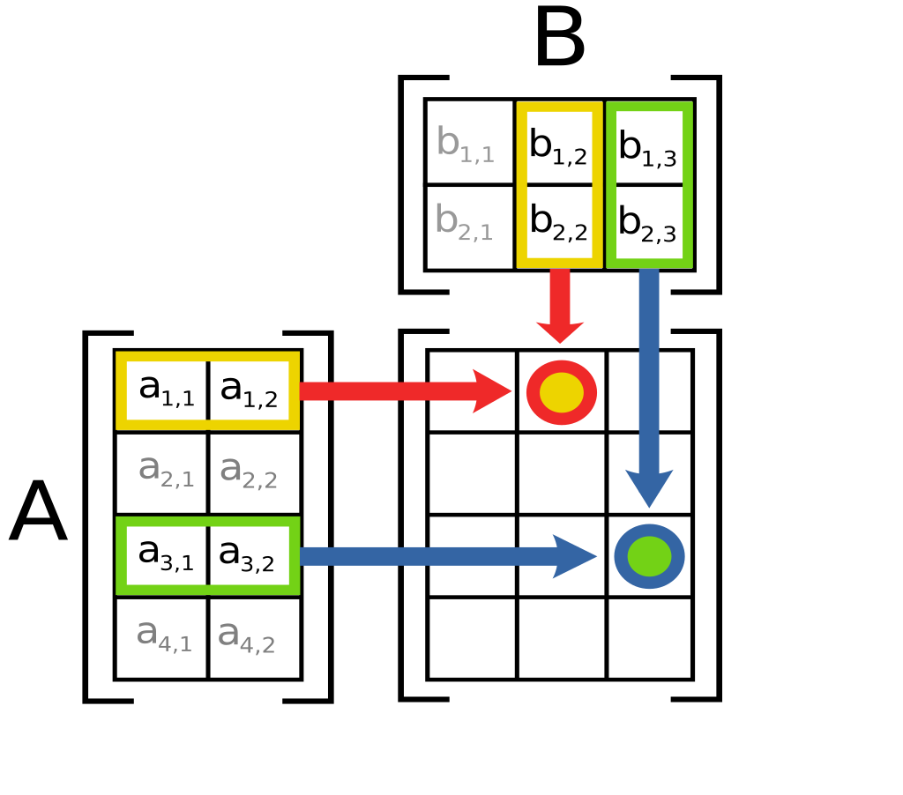

# Optional Homework 2.5

## NB: This repository could change until the 14th of May

Matrix multiplication is a fundamental operation in linear algebra with widespread applications in mathematics, computer science, physics, and engineering. Most notably, matrix multiplication is the core computation of virtually every machine learning model.

For the second **optional** homework, you should implement a shared memory parallel implementation of matrix multiplication. You can assume that the **A**, **B**, and **C** matrices are all size $n \times n$. Recall that the computation for each element $C_{ij}$ is equal to $\sum_{k=0}^{n - 1}A_{ik}B_{kj}$. See the image below for clarification.



As before, you should only write code in the file **your_code.c** and implement the function **matrix_multiplication**. However, you are free to look at the main.c file, but any changes you make will not be included in the final testing.

```c
void matrix_multiplication(const float *A, const float *B, float *C, int n);
```

Note that you are given the pointer to **C** where the results should be stored. You can also assume several additional properties for the input parameters to this function.

* The data in C has already been zero-initialized.
* The value of $n$ will always be a multiple of 16 and non-negative.
* The memory for A, B, and C will be aligned to 32-byte boundaries.
* All matrices are stored using the row-major layout, meaning you find $A_{i,j}$ using $A[i * n + j]$.

## Compiling and Testing

To test your implementation, compile the project by using
```
make
```
This will create an executable file called **prog** that automatically performs strong scalability experiments on your code. You can specify the number of threads you want to run by listing the numbers as command-line arguments to the program. For instance, running
```
./prog 2 4 6
```
Could generate the following output
```
Using n=1024
  P,          T,      S_rel,      GLOPS
  1,     6.8079,     1.0000,     0.3154
  2,     3.2659,     2.0846,     0.6576
  4,     2.1148,     3.2192,     1.0155
  6,     1.5137,     4.4975,     1.4187
```
Where **P** is the number of threads used, **T** is the time spent in seconds, **S_rel** is the relative speedup, and **GFLOPS** is the number of giga floating-point operations per second, based on the $\mathcal{O}(n^3)$ algorithm. The program will output a warning if it detects a likely error in your computation. Please let us know if you find any bugs with this validator, as you get the warning even if you know your results are correct. The value of **n** is set as a constant in the main.c file, feel free to change this value during testing, as well as the **NUM_RUNS** constant. For the final testing, we will increase these values to ensure a fair evaluation.

## The Distributed and Parallel Algorithms Cup

This is the second problem included in the **completely optional** implementation challenge for the lecture. If you chose to submit your implementation, we will run your code on one of the large machines (likely an AMD 128-core CPU) and you will be able to see how your code performs. It is strongly recommended to take part, even if you do not intend to compete for first place. Spending time to optimize small parts of code like this is a important learning experience for writing more efficient parallel code. The students in the two best teams (max two people per team) will also walk away with the prestigious Algorithm Engineering coffee cup. The rest of the results will be anonymous, so you do not have to worry about getting a bad placement.

### Scoring

Even though it is fun to see big speedup numbers, we will not be scoring your submission based on relative speedup. Instead, the most important metric is the absolute performance (meaning the **T** column from above). Unlike the first exercise, where the rules where less strict, this time around the correctness of your implementation is also important. The provided main file already includes automated testing of your implementation, so make sure that your implementation passes before you submit. Note that small reductions in numerical stability, as seen with Strassen's algorithm is completeley fine. However, incorrect submissions will not score points towards winning the cup.

For the final scoring, the submissions will be sorted based on parallel running time using the full machine (128 cores). The fastest submission will score 20 points, the second 19, and so on down to 1. You will accumulate points for each optional exercise, and the the winner in the end is the one with the most points. We plan to have six optional exercises in total. As mentioned, the first optional exercise gives only half the points.

## Tips and Other Details

For best performance, consider using the following commands once in the terminal you will use to run your code.
```
export OMP_NUM_THREADS=[number of cores on your machine]
export OMP_PLACES=cores
export OMP_PROC_BIND=spread/close
```
Note that this is completely outside the code, and you do not need to think about this for your submission. We will ensure the machine we use is configured for best performance.