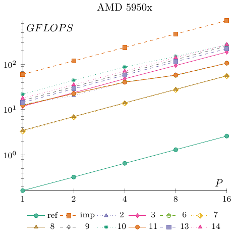
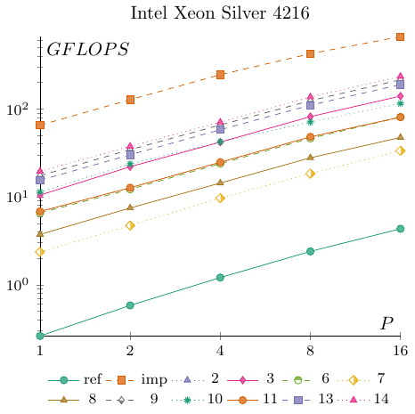

# Optional Homework 2.5 Results

Here are the **temporary** results for round two of the DPA Cup. As promised, the results have been anonymized. To find out how you performed, check your submission feedback on Moodle to see your hidden ID (if you submitted the first time your ID is the same). The two entries marked **ref** and **imp** are the two solutions added to the __exercise_sheet_2_5__ folder with the same names.

All experiments were done on an AMD Ryzen 9 5950X 16-Core Processor locked at 2.2 GHz. Each configuration was tested $4$ times, and the fastest run was used. Unlike the default value set in the main.c file, we increased $n$ to $4096$ for these experiments.

The first table gives the absolute running times in seconds. Having the lowest value in the 16 column is what matters for the competition.

| ID / P | 1 | 2 | 4 | 8 | 16 |
| -: | -: | -: | -: | -: | -: |
| 10 | 6.3344 | 3.1137 | 1.5818 | 0.9257 | 0.5110 |
| 11 | 11.1989 | 6.1278 | 3.4420 | 2.3959 | 1.3064 |
| 13 | 9.6391 | 4.7890 | 2.3890 | 1.2033 | 0.6264 |
| 14 | 7.7546 | 3.9108 | 1.9569 | 0.9840 | 0.5044 |
| 2 | 10.6137 | 6.7987 | 3.4458 | 2.3553 | 1.2946 |
| 3 | 11.6761 | 5.8567 | 2.8802 | 1.4672 | 0.7415 |
| 6 | 10.9404 | 6.1362 | 3.3978 | 2.4249 | 1.3043 |
| 7 | 42.0565 | 20.3905 | 10.0766 | 5.0706 | 2.5236 |
| 8 | 39.8854 | 19.7380 | 9.8408 | 4.9387 | 2.4708 |
| 9 | 8.6920 | 4.3347 | 2.1648 | 1.0885 | 0.5449 |
| imp | 2.3002 | 1.1601 | 0.5858 | 0.2947 | 0.1499 |
| ref | 851.6195 | 428.0579 | 212.8436 | 106.3242 | 53.2187 |

The next table gives the relative speedup $T_1 / T_p$ computed individually for each submission.

| ID / P | 1 | 2 | 4 | 8 | 16 |
| -: | -: | -: | -: | -: | -: |
| 10 | 1.0000 | 2.0344 | 4.0046 | 6.8428 | 12.3961 |
| 11 | 1.0000 | 1.8276 | 3.2536 | 4.6742 | 8.5723 |
| 13 | 1.0000 | 2.0128 | 4.0348 | 8.0106 | 15.3881 |
| 14 | 1.0000 | 1.9829 | 3.9627 | 7.8807 | 15.3739 |
| 2 | 1.0000 | 1.5611 | 3.0802 | 4.5063 | 8.1984 |
| 3 | 1.0000 | 1.9936 | 4.0539 | 7.9581 | 15.7466 |
| 6 | 1.0000 | 1.7829 | 3.2198 | 4.5117 | 8.3879 |
| 7 | 1.0000 | 2.0626 | 4.1737 | 8.2942 | 16.6653 |
| 8 | 1.0000 | 2.0207 | 4.0531 | 8.0761 | 16.1427 |
| 9 | 1.0000 | 2.0052 | 4.0152 | 7.9853 | 15.9516 |
| imp | 1.0000 | 1.9828 | 3.9266 | 7.8052 | 15.3449 |
| ref | 1.0000 | 1.9895 | 4.0012 | 8.0096 | 16.0023 |

Lastly, here are GFLOPS numbers for each submission. The machine runs at 2.2 GHz, and with AVX2 (FMA) each core can theoretically compute at a max rate of $2.2 * 32 = 70.4$ GFLOPS.

| ID / P | 1 | 2 | 4 | 8 | 16 |
| -: | -: | -: | -: | -: | -: |
| 10 | 21.6972 | 44.1401 | 86.8877 | 148.4703 | 268.9608 |
| 11 | 12.2725 | 22.4288 | 39.9300 | 57.3642 | 105.2043 |
| 13 | 14.2585 | 28.6989 | 57.5299 | 114.2184 | 219.4108 |
| 14 | 17.7235 | 35.1434 | 70.2330 | 139.6737 | 272.4801 |
| 2 | 12.9492 | 20.2155 | 39.8859 | 58.3531 | 106.1633 |
| 3 | 11.7710 | 23.4670 | 47.7185 | 93.6743 | 185.3526 |
| 6 | 12.5625 | 22.3981 | 40.4494 | 56.6782 | 105.3737 |
| 7 | 3.2680 | 6.7403 | 13.6394 | 27.1051 | 54.4615 |
| 8 | 3.4458 | 6.9632 | 13.9662 | 27.8290 | 55.6253 |
| 9 | 15.8121 | 31.7067 | 63.4881 | 126.2645 | 252.2278 |
| imp | 59.7509 | 118.4716 | 234.6175 | 466.3690 | 916.8709 |
| ref | 0.1614 | 0.3211 | 0.6457 | 1.2926 | 2.5825 |

