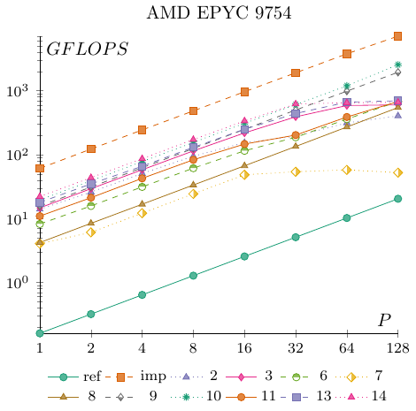

# Optional Homework 2.5 Results

Here are the results for round two of the DPA Cup. As promised, the results have been anonymized. To find out how you performed, check your submission feedback on Moodle to see your hidden ID (if you submitted the first time your ID is the same). The two entries marked **ref** and **imp** are the two solutions added to the __exercise_sheet_2_5__ folder with the same names.

All experiments were done on an AMD EPYC 9754 128-Core Processor. Each configuration was tested $128$ times, and the fastest run was used. Unlike the default value set in the main.c file, we increased $n$ to $4096$ for these experiments.

The first table gives the absolute running times in seconds. Having the lowest value in the 128 column is what matters for the competition.

| ID / P | 1 | 2 | 4 | 8 | 16 | 32 | 64 | 128 |
| -: | -: | -: | -: | -: | -: | -: | -: | -: |
| 10 | 7.0202 | 3.5279 | 1.7626 | 0.8846 | 0.4433 | 0.2263 | 0.1151 | 0.0537 |
| 11 | 12.5779 | 6.4770 | 3.2260 | 1.6543 | 0.9382 | 0.6787 | 0.3537 | 0.2030 |
| 13 | 7.6810 | 3.9384 | 2.0873 | 1.0564 | 0.5507 | 0.3119 | 0.2075 | 0.1971 |
| 14 | 6.2223 | 3.1454 | 1.5895 | 0.7972 | 0.4076 | 0.2217 | 0.2118 | 0.2081 |
| 2 | 9.8263 | 5.2894 | 2.7110 | 1.4533 | 0.8920 | 0.7094 | 0.4375 | 0.3402 |
| 3 | 9.3430 | 4.6825 | 2.3691 | 1.2004 | 0.6281 | 0.3513 | 0.2341 | 0.2284 |
| 6 | 16.7227 | 8.7233 | 4.3890 | 2.2361 | 1.1962 | 0.7342 | 0.3814 | 0.2028 |
| 7 | 33.9314 | 22.5918 | 11.3108 | 5.6488 | 2.8384 | 2.5444 | 2.3755 | 2.6289 |
| 8 | 32.6331 | 16.3285 | 8.2018 | 4.1041 | 2.0535 | 1.0233 | 0.5076 | 0.2517 |
| 9 | 8.7763 | 4.4088 | 2.2033 | 1.1008 | 0.5510 | 0.2752 | 0.1395 | 0.0706 |
| imp | 2.2516 | 1.1233 | 0.5641 | 0.2841 | 0.1424 | 0.0720 | 0.0363 | 0.0192 |
| ref | 859.0148 | 430.1922 | 215.0501 | 107.5782 | 53.7841 | 26.9248 | 13.4642 | 6.7367 |

The next table gives the relative speedup $T_1 / T_p$ computed individually for each submission.

| ID / P | 1 | 2 | 4 | 8 | 16 | 32 | 64 | 128 |
| -: | -: | -: | -: | -: | -: | -: | -: | -: |
| 10 | 1.0000 | 1.9899 | 3.9829 | 7.9360 | 15.8362 | 31.0217 | 60.9922 | 130.7300 |
| 11 | 1.0000 | 1.9419 | 3.8989 | 7.6032 | 13.4064 | 18.5323 | 35.5609 | 61.9601 |
| 13 | 1.0000 | 1.9503 | 3.6799 | 7.2709 | 13.9477 | 24.6265 | 37.0169 | 38.9701 |
| 14 | 1.0000 | 1.9782 | 3.9146 | 7.8052 | 15.2657 | 28.0663 | 29.3782 | 29.9005 |
| 2 | 1.0000 | 1.8577 | 3.6246 | 6.7614 | 11.0160 | 13.8516 | 22.4601 | 28.8839 |
| 3 | 1.0000 | 1.9953 | 3.9437 | 7.7832 | 14.8750 | 26.5955 | 39.9103 | 40.9063 |
| 6 | 1.0000 | 1.9170 | 3.8101 | 7.4785 | 13.9799 | 22.7768 | 43.8456 | 82.4591 |
| 7 | 1.0000 | 1.5019 | 2.9999 | 6.0068 | 11.9544 | 13.3357 | 14.2839 | 12.9071 |
| 8 | 1.0000 | 1.9985 | 3.9788 | 7.9513 | 15.8915 | 31.8901 | 64.2890 | 129.6508 |
| 9 | 1.0000 | 1.9906 | 3.9833 | 7.9727 | 15.9279 | 31.8906 | 62.9125 | 124.3102 |
| imp | 1.0000 | 2.0045 | 3.9915 | 7.9254 | 15.8118 | 31.2722 | 62.0275 | 117.2708 |
| ref | 1.0000 | 1.9968 | 3.9945 | 7.9850 | 15.9715 | 31.9042 | 63.7999 | 127.5127 |

Lastly, here are GFLOPS numbers for each submission.

| ID / P | 1 | 2 | 4 | 8 | 16 | 32 | 64 | 128 |
| -: | -: | -: | -: | -: | -: | -: | -: | -: |
| 10 | 19.5776 | 38.9577 | 77.9751 | 155.3685 | 310.0360 | 607.3308 | 1194.0830 | 2559.3846 |
| 11 | 10.9270 | 21.2195 | 42.6035 | 83.0798 | 146.4922 | 202.5032 | 388.5749 | 677.0392 |
| 13 | 17.8934 | 34.8972 | 65.8453 | 130.1012 | 249.5714 | 440.6507 | 662.3564 | 697.3057 |
| 14 | 22.0881 | 43.6952 | 86.4668 | 172.4021 | 337.1908 | 619.9321 | 648.9091 | 660.4467 |
| 2 | 13.9868 | 25.9838 | 50.6968 | 94.5703 | 154.0795 | 193.7397 | 314.1462 | 403.9946 |
| 3 | 14.7104 | 29.3516 | 58.0131 | 114.4943 | 218.8170 | 391.2296 | 587.0951 | 601.7467 |
| 6 | 8.2187 | 15.7554 | 31.3144 | 61.4637 | 114.8963 | 187.1955 | 360.3538 | 677.7069 |
| 7 | 4.0505 | 6.0836 | 12.1511 | 24.3306 | 48.4213 | 54.0163 | 57.8569 | 52.2800 |
| 8 | 4.2116 | 8.4171 | 16.7572 | 33.4882 | 66.9291 | 134.3095 | 270.7623 | 546.0427 |
| 9 | 15.6602 | 31.1738 | 62.3787 | 124.8537 | 249.4355 | 499.4148 | 985.2255 | 1946.7274 |
| imp | 61.0406 | 122.3528 | 243.6429 | 483.7696 | 965.1612 | 1908.8744 | 3786.1971 | 7158.2788 |
| ref | 0.1600 | 0.3195 | 0.6391 | 1.2776 | 2.5554 | 5.1045 | 10.2077 | 20.4015 |

## Points Scored

Here are the points scored for this exercise. We initially had issues with our large 128-core machine and therefore included preliminary results using two 16-core machines instead. You can still find the results from these two machines in the **data** folder. The results did differ slightly between machines, but we have decided that it is most fair to use the 128-core results since this was what we stated in the assignment originally.

| ID | Points | Time |
| -: | -: | -: |
| imp | 20 | 0.0192 |
| 10 | 19 | 0.0537 |
| 9 | 18 | 0.0706 |
| 13 | 17 | 0.1971 |
| 6 | 16 | 0.2028 |
| 11 | 15 | 0.2030 |
| 14 | 14 | 0.2081 |
| 3 | 13 | 0.2284 |
| 8 | 12 | 0.2517 |
| 2 | 11 | 0.3402 |
| 7 | 10 | 2.6289 |
| ref | 9 | 6.7367 |

The results got very close for a few of the submissions. Please note that we used the best run from 128 tries to minimize noise in the results as much as possible.