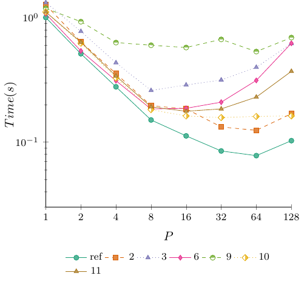
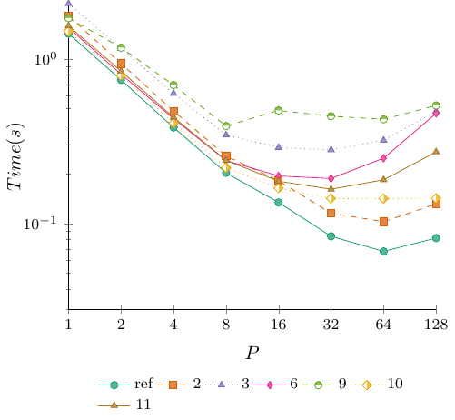
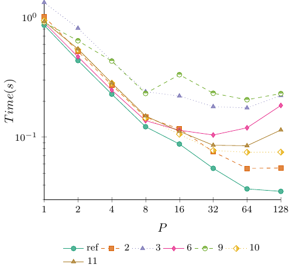
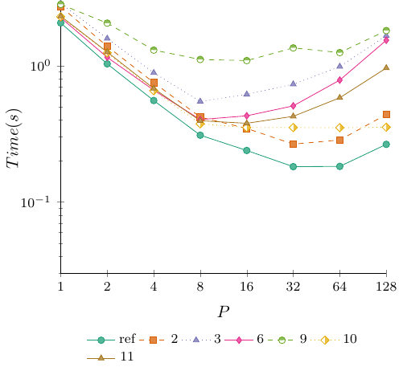
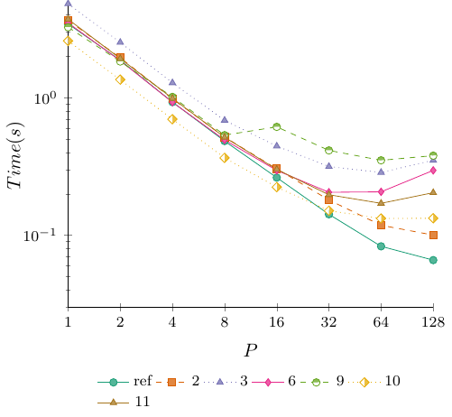

# Optional Homework 4.5 Results

Here are the results for round four of the DPA Cup. As promised, the results have been anonymized. To find out how you performed, check your submission feedback on Moodle to view your hidden ID (if you submitted before, your ID will be the same). The entry marked **ref** is the reference implementation. The code for this has been added to the __exercise_sheet_4_5__ folder with the same name.

All experiments were done on an AMD EPYC 9754 128-Core Processor. Each configuration was tested $8$ times, and the fastest run was used. We use the following instance for testing.

| Instance | Vertices | Edges |
| :- | -: | -: |
| road_usa | 23,947,347 | 57,708,624 |
| hugebubbles-00020 | 21,198,119 | 63,580,358 |
| delaunay_n24 | 16,777,216 | 100,663,202 |
| europe_osm | 50,912,018 | 108,109,320 |
| rgg_n_2_24_s0 | 16,777,216 | 265,114,400 |

## Time

The first set of tables and figures gives the absolute running times in seconds. Having the lowest value in the 128 column is what matters for the competition.

### road_usa

| ID / P | 1 | 2 | 4 | 8 | 16 | 32 | 64 | 128 |
| -: | -: | -: | -: | -: | -: | -: | -: | -: |
| 10 | 1.1094 | 0.6233 | 0.3276 | 0.1821 | 0.1619 | 0.1572 | 0.1606 | 0.1622 |
| 11 | 1.1102 | 0.6352 | 0.3392 | 0.1917 | 0.1768 | 0.1846 | 0.2297 | 0.3702 |
| 2 | 1.2672 | 0.6387 | 0.3549 | 0.1958 | 0.1848 | 0.1322 | 0.1241 | 0.1689 |
| 3 | 1.3231 | 0.7752 | 0.4340 | 0.2597 | 0.2875 | 0.3152 | 0.3989 | 0.6191 |
| 6 | 1.0728 | 0.5401 | 0.3111 | 0.1843 | 0.1867 | 0.2091 | 0.3128 | 0.6223 |
| 9 | 1.1883 | 0.9279 | 0.6302 | 0.6001 | 0.5752 | 0.6685 | 0.5336 | 0.6914 |
| ref | 1.0024 | 0.5124 | 0.2779 | 0.1504 | 0.1120 | 0.0847 | 0.0777 | 0.1025 |

### hugebubbles-00020

| ID / P | 1 | 2 | 4 | 8 | 16 | 32 | 64 | 128 |
| -: | -: | -: | -: | -: | -: | -: | -: | -: |
| 10 | 1.4693 | 0.7929 | 0.4073 | 0.2182 | 0.1639 | 0.1417 | 0.1416 | 0.1421 |
| 11 | 1.5868 | 0.8428 | 0.4417 | 0.2417 | 0.1806 | 0.1614 | 0.1841 | 0.2721 |
| 2 | 1.8288 | 0.9360 | 0.4823 | 0.2572 | 0.1813 | 0.1154 | 0.1025 | 0.1312 |
| 3 | 2.1630 | 1.1575 | 0.6159 | 0.3444 | 0.2891 | 0.2797 | 0.3199 | 0.4800 |
| 6 | 1.5466 | 0.8074 | 0.4331 | 0.2411 | 0.1944 | 0.1875 | 0.2491 | 0.4668 |
| 9 | 1.7698 | 1.1699 | 0.6935 | 0.3909 | 0.4859 | 0.4484 | 0.4293 | 0.5209 |
| ref | 1.4239 | 0.7450 | 0.3830 | 0.2030 | 0.1341 | 0.0835 | 0.0676 | 0.0815 |

### delaunay_n24

| ID / P | 1 | 2 | 4 | 8 | 16 | 32 | 64 | 128 |
| -: | -: | -: | -: | -: | -: | -: | -: | -: |
| 10 | 0.9403 | 0.5354 | 0.2818 | 0.1441 | 0.1055 | 0.0772 | 0.0747 | 0.0749 |
| 11 | 0.9219 | 0.5438 | 0.2824 | 0.1499 | 0.1116 | 0.0854 | 0.0846 | 0.1145 |
| 2 | 1.0143 | 0.5180 | 0.2717 | 0.1464 | 0.1170 | 0.0754 | 0.0547 | 0.0552 |
| 3 | 1.3296 | 0.8098 | 0.4328 | 0.2390 | 0.2200 | 0.1794 | 0.1751 | 0.2222 |
| 6 | 0.8992 | 0.4682 | 0.2464 | 0.1370 | 0.1139 | 0.1040 | 0.1194 | 0.1835 |
| 9 | 0.9073 | 0.6370 | 0.4307 | 0.2313 | 0.3316 | 0.2321 | 0.2048 | 0.2305 |
| ref | 0.8585 | 0.4353 | 0.2280 | 0.1219 | 0.0874 | 0.0548 | 0.0369 | 0.0352 |

### europe_osm

| ID / P | 1 | 2 | 4 | 8 | 16 | 32 | 64 | 128 |
| -: | -: | -: | -: | -: | -: | -: | -: | -: |
| 10 | 2.2901 | 1.2443 | 0.6571 | 0.3751 | 0.3522 | 0.3523 | 0.3513 | 0.3542 |
| 11 | 2.3107 | 1.2616 | 0.6811 | 0.3953 | 0.3785 | 0.4256 | 0.5824 | 0.9626 |
| 2 | 2.7168 | 1.3887 | 0.7530 | 0.4201 | 0.3469 | 0.2661 | 0.2854 | 0.4387 |
| 3 | 2.8712 | 1.5842 | 0.8879 | 0.5470 | 0.6168 | 0.7324 | 0.9867 | 1.6622 |
| 6 | 2.2544 | 1.1536 | 0.6622 | 0.4031 | 0.4294 | 0.5079 | 0.7849 | 1.5393 |
| 9 | 2.8195 | 2.0553 | 1.3033 | 1.1124 | 1.0915 | 1.3522 | 1.2491 | 1.8115 |
| ref | 2.0624 | 1.0328 | 0.5560 | 0.3095 | 0.2391 | 0.1819 | 0.1827 | 0.2651 |

### rgg_n_2_24_s0

| ID / P | 1 | 2 | 4 | 8 | 16 | 32 | 64 | 128 |
| -: | -: | -: | -: | -: | -: | -: | -: | -: |
| 10 | 2.5815 | 1.3503 | 0.6961 | 0.3648 | 0.2238 | 0.1507 | 0.1324 | 0.1329 |
| 11 | 3.7087 | 1.9193 | 0.9870 | 0.5149 | 0.3009 | 0.1969 | 0.1706 | 0.2038 |
| 2 | 3.6308 | 1.9473 | 0.9789 | 0.5167 | 0.3037 | 0.1804 | 0.1182 | 0.1003 |
| 3 | 4.8032 | 2.5155 | 1.2797 | 0.6836 | 0.4439 | 0.3157 | 0.2857 | 0.3506 |
| 6 | 3.4851 | 1.8531 | 0.9257 | 0.4926 | 0.2960 | 0.2052 | 0.2067 | 0.2959 |
| 9 | 3.2444 | 1.8284 | 1.0110 | 0.5335 | 0.6127 | 0.4133 | 0.3503 | 0.3787 |
| ref | 3.4288 | 1.8685 | 0.9275 | 0.4833 | 0.2623 | 0.1420 | 0.0831 | 0.0660 |

## Speedup

The next set of tables gives the relative speedup $T_1 / T_p$ computed individually for each submission.

### road_usa

| ID / P | 1 | 2 | 4 | 8 | 16 | 32 | 64 | 128 |
| -: | -: | -: | -: | -: | -: | -: | -: | -: |
| 10 | 1.0000 | 1.7799 | 3.3864 | 6.0923 | 6.8524 | 7.0573 | 6.9078 | 6.8397 |
| 11 | 1.0000 | 1.7478 | 3.2730 | 5.7913 | 6.2794 | 6.0141 | 4.8333 | 2.9989 |
| 2 | 1.0000 | 1.9840 | 3.5706 | 6.4719 | 6.8571 | 9.5855 | 10.2111 | 7.5027 |
| 3 | 1.0000 | 1.7068 | 3.0486 | 5.0947 | 4.6021 | 4.1977 | 3.3169 | 2.1371 |
| 6 | 1.0000 | 1.9863 | 3.4484 | 5.8209 | 5.7461 | 5.1306 | 3.4297 | 1.7239 |
| 9 | 1.0000 | 1.2806 | 1.8856 | 1.9802 | 2.0659 | 1.7776 | 2.2269 | 1.7187 |
| ref | 1.0000 | 1.9563 | 3.6071 | 6.6649 | 8.9500 | 11.8347 | 12.9009 | 9.7795 |

### hugebubbles-00020

| ID / P | 1 | 2 | 4 | 8 | 16 | 32 | 64 | 128 |
| -: | -: | -: | -: | -: | -: | -: | -: | -: |
| 10 | 1.0000 | 1.8531 | 3.6074 | 6.7337 | 8.9646 | 10.3691 | 10.3764 | 10.3399 |
| 11 | 1.0000 | 1.8828 | 3.5925 | 6.5652 | 8.7863 | 9.8315 | 8.6192 | 5.8317 |
| 2 | 1.0000 | 1.9538 | 3.7918 | 7.1104 | 10.0871 | 15.8475 | 17.8420 | 13.9390 |
| 3 | 1.0000 | 1.8687 | 3.5119 | 6.2805 | 7.4818 | 7.7333 | 6.7615 | 4.5063 |
| 6 | 1.0000 | 1.9155 | 3.5710 | 6.4148 | 7.9558 | 8.2485 | 6.2088 | 3.3132 |
| 9 | 1.0000 | 1.5128 | 2.5520 | 4.5275 | 3.6423 | 3.9469 | 4.1225 | 3.3976 |
| ref | 1.0000 | 1.9113 | 3.7178 | 7.0143 | 10.6182 | 17.0527 | 21.0636 | 17.4712 |

### delaunay_n24

| ID / P | 1 | 2 | 4 | 8 | 16 | 32 | 64 | 128 |
| -: | -: | -: | -: | -: | -: | -: | -: | -: |
| 10 | 1.0000 | 1.7563 | 3.3368 | 6.5253 | 8.9128 | 12.1801 | 12.5877 | 12.5541 |
| 11 | 1.0000 | 1.6953 | 3.2645 | 6.1501 | 8.2608 | 10.7951 | 10.8972 | 8.0515 |
| 2 | 1.0000 | 1.9581 | 3.7332 | 6.9283 | 8.6692 | 13.4523 | 18.5430 | 18.3750 |
| 3 | 1.0000 | 1.6419 | 3.0721 | 5.5632 | 6.0436 | 7.4114 | 7.5934 | 5.9838 |
| 6 | 1.0000 | 1.9205 | 3.6494 | 6.5635 | 7.8946 | 8.6462 | 7.5310 | 4.9003 |
| 9 | 1.0000 | 1.4243 | 2.1066 | 3.9226 | 2.7361 | 3.9091 | 4.4302 | 3.9362 |
| ref | 1.0000 | 1.9722 | 3.7654 | 7.0427 | 9.8227 | 15.6661 | 23.2656 | 24.3892 |

### europe_osm

| ID / P | 1 | 2 | 4 | 8 | 16 | 32 | 64 | 128 |
| -: | -: | -: | -: | -: | -: | -: | -: | -: |
| 10 | 1.0000 | 1.8405 | 3.4852 | 6.1053 | 6.5023 | 6.5004 | 6.5189 | 6.4656 |
| 11 | 1.0000 | 1.8316 | 3.3926 | 5.8454 | 6.1049 | 5.4293 | 3.9675 | 2.4005 |
| 2 | 1.0000 | 1.9564 | 3.6080 | 6.4670 | 7.8317 | 10.2097 | 9.5193 | 6.1928 |
| 3 | 1.0000 | 1.8124 | 3.2337 | 5.2490 | 4.6550 | 3.9203 | 2.9099 | 1.7273 |
| 6 | 1.0000 | 1.9542 | 3.4044 | 5.5927 | 5.2501 | 4.4387 | 2.8722 | 1.4646 |
| 9 | 1.0000 | 1.3718 | 2.1634 | 2.5346 | 2.5831 | 2.0851 | 2.2572 | 1.5564 |
| ref | 1.0000 | 1.9969 | 3.7094 | 6.6637 | 8.6257 | 11.3381 | 11.2885 | 7.7797 |

### rgg_n_2_24_s0

| ID / P | 1 | 2 | 4 | 8 | 16 | 32 | 64 | 128 |
| -: | -: | -: | -: | -: | -: | -: | -: | -: |
| 10 | 1.0000 | 1.9118 | 3.7085 | 7.0765 | 11.5349 | 17.1301 | 19.4977 | 19.4244 |
| 11 | 1.0000 | 1.9323 | 3.7575 | 7.2028 | 12.3254 | 18.8354 | 21.7392 | 18.1977 |
| 2 | 1.0000 | 1.8645 | 3.7091 | 7.0269 | 11.9552 | 20.1264 | 30.7174 | 36.1994 |
| 3 | 1.0000 | 1.9094 | 3.7534 | 7.0263 | 10.8205 | 15.2144 | 16.8120 | 13.6999 |
| 6 | 1.0000 | 1.8807 | 3.7648 | 7.0749 | 11.7740 | 16.9839 | 16.8607 | 11.7780 |
| 9 | 1.0000 | 1.7744 | 3.2091 | 6.0813 | 5.2953 | 7.8500 | 9.2618 | 8.5672 |
| ref | 1.0000 | 1.8351 | 3.6968 | 7.0946 | 13.0721 | 24.1465 | 41.2611 | 51.9515 |

## Points Scored

To assign points for this round, we consider each graph to be a separate competition and use the average placement to determine the final list.

| ID | Points | Average Rank |
| -: | -: | -: |
| ref | 20 | 1 |
| 2 | 19 | 2.4 |
| 10 | 18 | 2.6 |
| 11 | 17 | 4 |
| 6 | 16 | 5.2 |
| 3 | 15 | 5.8 |
| 9 | 14 | 7 |
