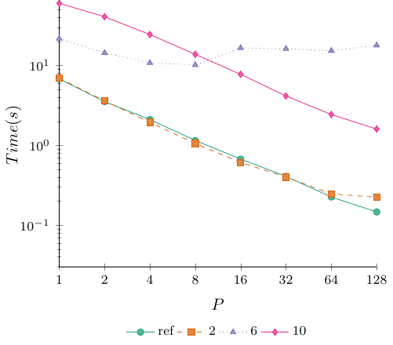
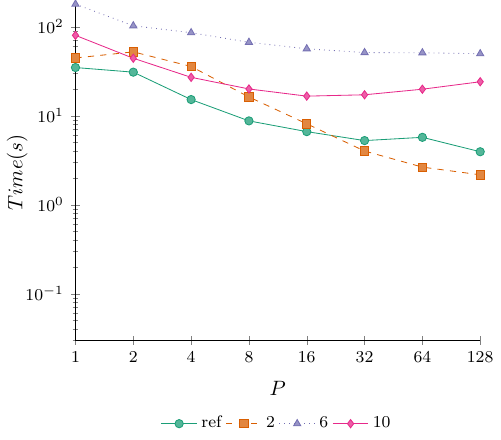
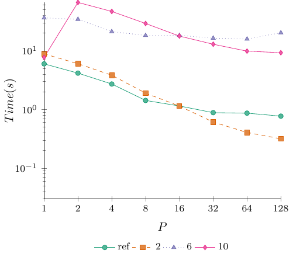
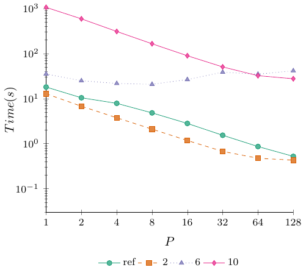
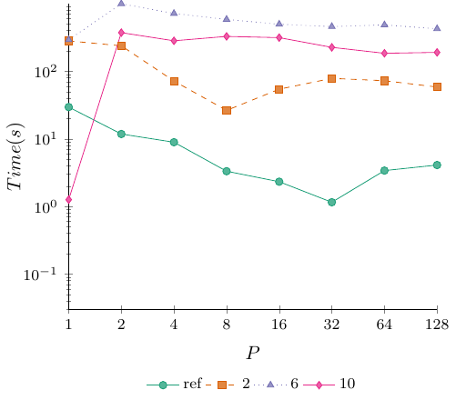

# Optional Homework 5.5 Results

Here are the results for round five of the DPA Cup. As promised, the results have been anonymized. To find out how you performed, check your submission feedback on Moodle to view your hidden ID (if you submitted before, your ID will be the same). The entry marked **ref** is the reference implementation. The code for this has been added to the __exercise_sheet_4_5__ folder with the same name. It implements the Pothen-Fan algorithm with the Karp-Sipser algorithm to compute an initial solution. Interestingly, the fairness part of Pothen-Fan had a massive impact on performance. On some instances, the version with fairness was several orders of magnitude faster.

All experiments were done on an AMD EPYC 9754 128-Core Processor. Each configuration was tested $10$ times, and the **average** run was used. The reason for using average instead of best is that these algorithms are non-deterministic in the parallel setting. For the reference implementation, the paths we find heavily rely on how the threads are scheduled. This leads to some strange-looking results, for instance, a speedup of three using two threads on the rgg_n_2_24_s0 graph. I have not inspected the code for each submission. Still, based on the results, it seems clear that everyone has non-deterministic programs (an extreme example is ID 10 and 6 on rgg_n_2_24_s0). 

We again use the following instance for testing.

| Instance | Vertices | Edges |
| :- | -: | -: |
| road_usa | 23,947,347 | 57,708,624 |
| hugebubbles-00020 | 21,198,119 | 63,580,358 |
| delaunay_n24 | 16,777,216 | 100,663,202 |
| europe_osm | 50,912,018 | 108,109,320 |
| rgg_n_2_24_s0 | 16,777,216 | 265,114,400 |

## Time

The first set of tables and figures gives the absolute running times in seconds. Having the lowest value in the 128 column is what matters for the competition.

### road_usa

| ID / P | 1 | 2 | 4 | 8 | 16 | 32 | 64 | 128 |
| -: | -: | -: | -: | -: | -: | -: | -: | -: |
| 2 | 6.9755 | 3.6093 | 1.9484 | 1.0564 | 0.6114 | 0.4008 | 0.2467 | 0.2241 |
| 6 | 21.7846 | 14.4288 | 10.8048 | 10.1823 | 16.6200 | 16.2327 | 15.3327 | 17.9656 |
| 10 | 60.4405 | 40.9706 | 24.4987 | 13.8290 | 7.7833 | 4.1567 | 2.4370 | 1.6020 |
| ref | 6.8211 | 3.5415 | 2.1067 | 1.1529 | 0.6729 | 0.4092 | 0.2252 | 0.1465 |

### hugebubbles-00020

| ID / P | 1 | 2 | 4 | 8 | 16 | 32 | 64 | 128 |
| -: | -: | -: | -: | -: | -: | -: | -: | -: |
| 2 | 44.7089 | 52.3650 | 35.8782 | 16.2861 | 8.1402 | 4.0250 | 2.6554 | 2.1752 |
| 6 | 179.9498 | 102.7846 | 85.9800 | 67.0795 | 56.7111 | 51.4226 | 51.1425 | 49.8860 |
| 10 | 80.2873 | 44.3755 | 27.0908 | 20.0516 | 16.6543 | 17.2479 | 19.9262 | 24.1559 |
| ref | 34.8983 | 30.9693 | 15.2404 | 8.7791 | 6.6493 | 5.2735 | 5.7387 | 3.9529 |

### delaunay_n24

| ID / P | 1 | 2 | 4 | 8 | 16 | 32 | 64 | 128 |
| -: | -: | -: | -: | -: | -: | -: | -: | -: |
| 2 | 8.8462 | 6.0147 | 3.8256 | 1.8967 | 1.1402 | 0.6101 | 0.4049 | 0.3157 |
| 6 | 36.2869 | 34.3474 | 21.1947 | 18.2279 | 18.2647 | 16.3973 | 15.8323 | 20.2608 |
| 10 | 7.7249 | 66.5724 | 46.7412 | 29.1358 | 17.7909 | 12.9044 | 9.8480 | 9.2618 |
| ref | 5.9766 | 4.1552 | 2.7122 | 1.4232 | 1.1454 | 0.8814 | 0.8645 | 0.7691 |

### europe_osm

| ID / P | 1 | 2 | 4 | 8 | 16 | 32 | 64 | 128 |
| -: | -: | -: | -: | -: | -: | -: | -: | -: |
| 2 | 12.7943 | 6.7538 | 3.7536 | 2.0972 | 1.1736 | 0.6731 | 0.4738 | 0.4297 |
| 6 | 35.1737 | 24.8784 | 21.6642 | 20.7555 | 26.4298 | 38.5444 | 34.7322 | 41.4311 |
| 10 | 1056.9360 | 587.7692 | 308.5816 | 164.5230 | 89.2370 | 50.4101 | 32.2054 | 27.5534 |
| ref | 18.0311 | 10.4185 | 7.8380 | 4.8129 | 2.8061 | 1.5345 | 0.8624 | 0.5222 |

### rgg_n_2_24_s0

| ID / P | 1 | 2 | 4 | 8 | 16 | 32 | 64 | 128 |
| -: | -: | -: | -: | -: | -: | -: | -: | -: |
| 2 | 280.8058 | 237.3310 | 71.5476 | 26.3224 | 54.2265 | 78.3426 | 72.3634 | 58.3499
| 6 | 291.5391 | 993.3718 | 713.5837 | 583.2688 | 494.3237 | 457.0695 | 483.6819 | 423.8972
| 10 | 1.2600 | 371.7427 | 281.7199 | 327.0582 | 313.5956 | 225.2671 | 184.0928 | 189.7623
| ref | 29.5002 | 11.7792 | 8.9110 | 3.3204 | 2.3229 | 1.1538 | 3.3918 | 4.0962

## Points Scored

To assign points for this round, we consider each graph to be a separate competition and use the average placement to determine the final list.

| ID | Points | Average Rank |
| -: | -: | -: |
| 2 | 20 | 1.4 |
| ref | 19 | 1.6 |
| 10 | 18 | 3 |
| 6 | 17 | 4 |
